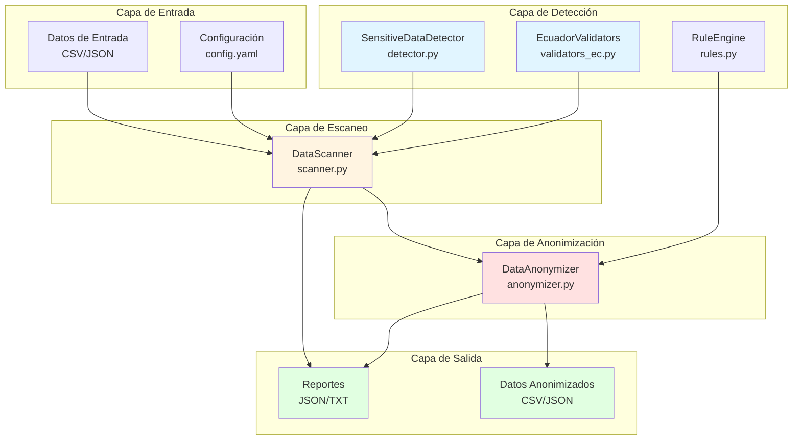
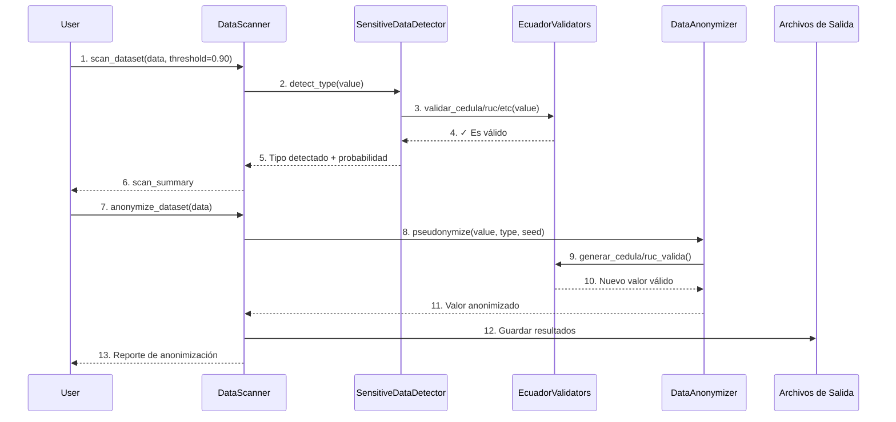
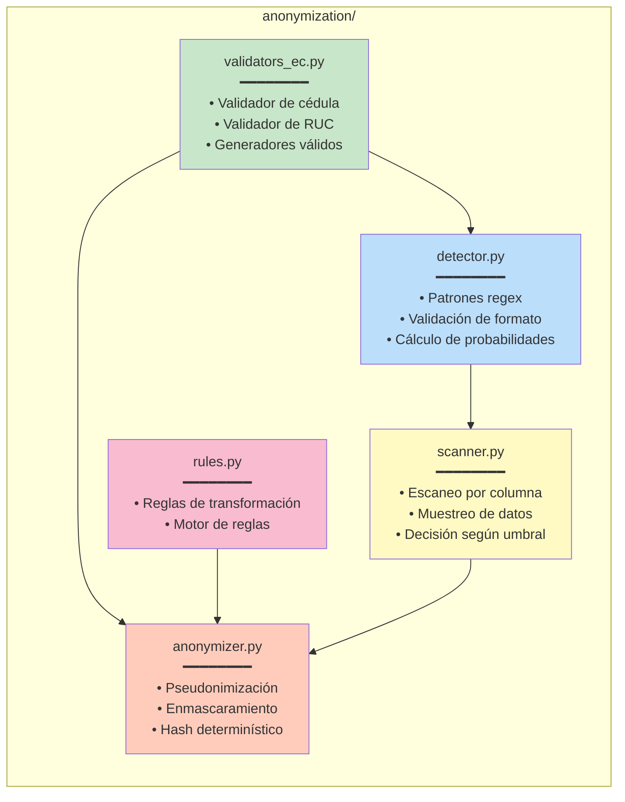
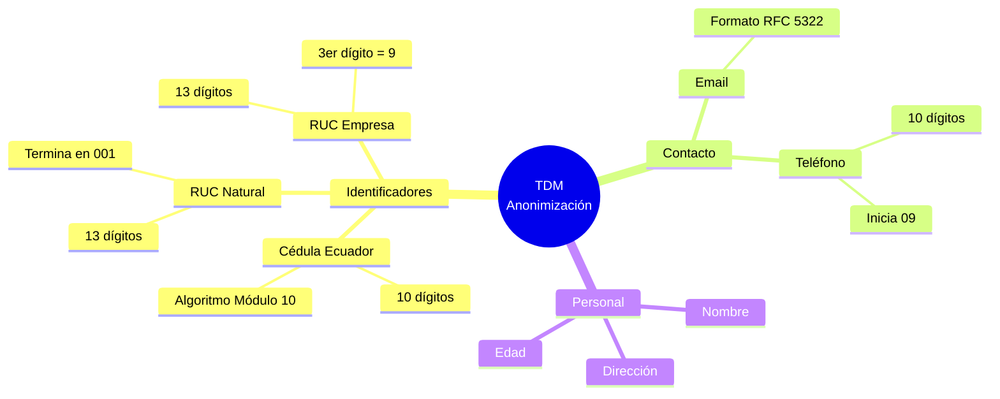
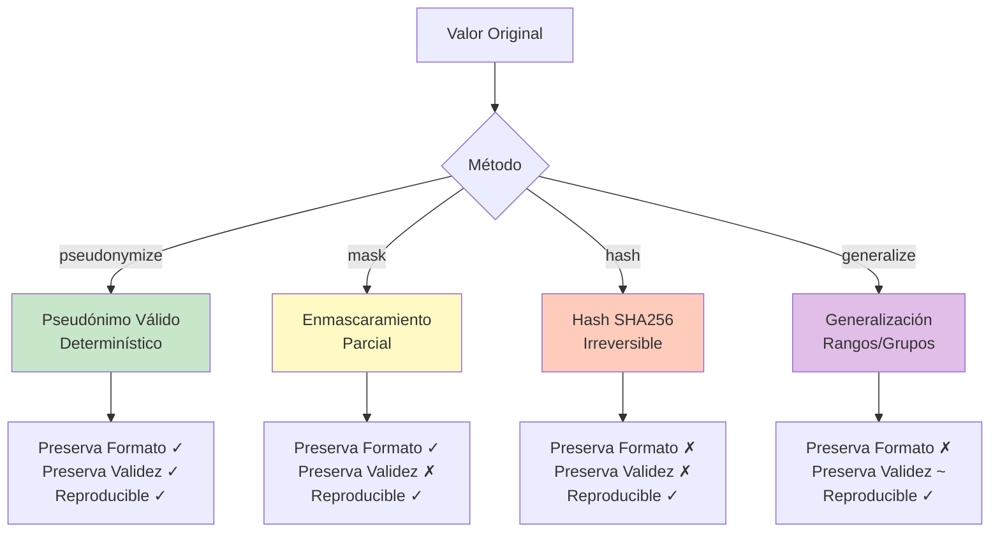
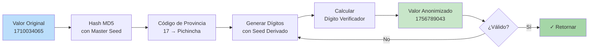

# Diagrama de Arquitectura - TDM Anonimización

## Arquitectura del Sistema



## Flujo de Procesamiento



## Componentes y Responsabilidades



## Tipos de Datos Soportados



## Estructura de Directorios

```
tdm_anonimizacion/
│
├── anonymization/          # Módulo principal
│   ├── __init__.py        # Exporta clases principales
│   ├── detector.py        # Detección de datos sensibles
│   ├── scanner.py         # Escaneo y orquestación
│   ├── anonymizer.py      # Anonimización determinística
│   ├── validators_ec.py   # Validadores de Ecuador
│   ├── rules.py           # Motor de reglas
│   └── config.yaml        # Configuración global
│
├── synthetic_data/         # Generación de datos sintéticos
│   ├── generator.py       # Generador base
│   ├── cliente_generator.py  # Generador de clientes
│   ├── validator.py       # Validadores de calidad
│   ├── profiler.py        # Perfilado de datos
│   └── fault_injector.py  # Inyección de errores
│
├── tests/                  # Suite de pruebas
│   ├── run_all_tests.py   # Ejecutor principal
│   ├── test_detector.py   # Tests de detección
│   ├── test_scanner.py    # Tests de escaneo
│   ├── test_anonymizer.py # Tests de anonimización
│   └── test_validators_ec.py  # Tests de validadores
│
├── data/                   # Datos de entrada/salida
│   ├── input/             # Archivos originales
│   └── output/            # Archivos procesados
│
├── reports/                # Reportes generados
├── examples/               # Ejemplos de uso
└── docs/                   # Documentación
```

## Parámetros Configurables

| Parámetro | Ubicación | Valor por Defecto | Descripción |
|-----------|-----------|-------------------|-------------|
| `threshold` | scanner.py L25 | 0.90 | Umbral de probabilidad (0.0-1.0) |
| `seed` | scanner.py L25 | None | Semilla para reproducibilidad |
| `master_seed` | anonymizer.py | None | Semilla maestra del anonimizador |
| `patterns` | config.yaml L8-26 | Varios | Patrones de detección regex |
| `default_method` | config.yaml L30 | pseudonymize | Método de anonimización por defecto |

## Métodos de Anonimización



## Flujo de Anonimización Determinística



